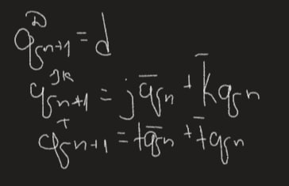

# Lab 5: Latches and Flip-flops

## Preparation tasks (done before the lab at home)

1. Write characteristic equations and complete truth tables for D, JK, T flip-flops where `q(n)` represents main output value before the clock edge and `q(n+1)` represents output value after the clock edge.

  
   <!--
   https://editor.codecogs.com/
   \begin{align*}
       q_{n+1}^D =&~D \\
       q_{n+1}^{JK} =& \\
       q_{n+1}^T =& \\
   \end{align*}
   -->

   **D-type FF**
   | **clk** | **d** | **q(n)** | **q(n+1)** | **Comments** |
   | :-: | :-: | :-: | :-: | :-- |
   | ↑ | 0 | 0 | 0 | `q(n+1)` has the same level as `d` |
   | ↑ | 0 | 1 | 0 | Output did not change |
   | ↑ | 1 | 0 | 1 | `q(n+1)` has the same level as `d` |
   | ↑ | 1 | 1 | 1 | Output did not change |

   **JK-type FF**
   | **clk** | **j** | **k** | **q(n)** | **q(n+1)** | **Comments** |
   | :-: | :-: | :-: | :-: | :-: | :-- |
   | ↑ | 0 | 0 | 0 | 0 | Output did not change |
   | ↑ | 0 | 0 | 1 | 1 | Output did not change |
   | ↑ | 0 | 1 | 0 | 0 | Reset output value |
   | ↑ | 0 | 1 | 1 | 0 | Reset output value |
   | ↑ | 1 | 0 | 0 | 1 | Set output value |
   | ↑ | 1 | 0 | 1 | 1 | Set output value |
   | ↑ | 1 | 1 | 0 | 1 | Toggle output value |
   | ↑ | 1 | 1 | 1 | 0 | Toggle output value |

   **T-type FF**
   | **clk** | **t** | **q(n)** | **q(n+1)** | **Comments** |
   | :-: | :-: | :-: | :-: | :-- |
   | ↑ | 0 | 0 | 0 | Output did not change |
   | ↑ | 0 | 1 | 1 | Output did not change |
   | ↑ | 1 | 0 | 1 | Toggle output value |
   | ↑ | 1 | 1 | 0 | Toggle output value |

